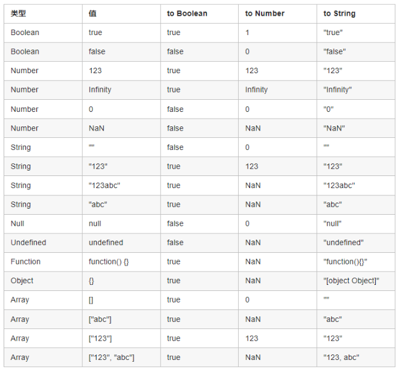

# 速记第六天
1. 渐进增强和优雅降级的区别？
   
   **渐进增强**
   渐进增强（Progressive Enhancement）：一开始就针对低版本浏览器进行构建页面，完成基本的功能，然后再针对高级浏览器进行效果、交互、追加功能达到更好的体验。
    
   **优雅降级**
   一开始就构建站点的完整功能，然后针对浏览器测试和修复。比如一开始使用 CSS3 的特性构建了一个应用，然后逐步针对各大浏览器进行 hack 使其可以在低版本浏览器上正常浏览。

   **区别**
   广义上说，其实要定义一个基准线，在此之上的增强叫做渐进增强，在此之下的兼容叫优雅降级
   狭义上说：渐进增强一般说的是使用 CSS3 技术，在不影响老浏览器的正常显示与使用情形下来增强体验，而优雅降级则是体现 html 标签的语义，以便在 js/css 的加载失败/被禁用时，也不影响用户的相应功能。

2. 浏览器样式兼容？
   
   **CSS默认样式重置**
   每个浏览器的 `CSS` 默认样式不尽相同，所以最简单有效的方式就是对其进行初始化重置（覆盖默认样式）
   开发中常用的库有：`normalize.css`, `reset.css`

3.  CSS中伪元素、伪类区别?
    
    **伪元素**
    after、before用于创建一些不在文档树中的元素，并为其添加样式。比如说，我们可以通过::before来在一个元素前添加一些文本，并为这些文本添加样式。虽然用户可以看到这些文本，但是这些文本实际不在文档树中。
    
    **伪类**
    伪类，点击操作，是一个以冒号作为前缀，被添加到一个选择器末尾的关键字，当你希望样式在特定状态才被呈现到指定的元素时，你可以往元素的选择器后面加上对应的伪类。

    **区别**
    是否创造了新的元素
    伪类是通过在元素选择器上加入伪类改变元素状态
    伪元素通过对元素的操作进行对元素的改变。

4. 谈一下你对CDN的了解？
   
   **定义**
   CDN指内容分发网络，它是构建在现有网络基础之上的智能虚拟网络，使用户就近获取所需内容，降低网络拥塞，提高用户访问响应速度和命中率。

   **原理**
   CDN 的关键技术主要有内容存储和分发技术。简单来讲，CDN就是根据用户位置分配最近的资源
   应用CDN后，DNS 返回的不再是 IP 地址，而是一个CNAME(Canonical Name ) 别名记录，指向CDN的全局负载均衡。
   CNAME实际上在域名解析的过程中承担了中间人（或者说代理）的角色，这是CDN实现的关键。

5. 你知道那些常见的浏览器兼容问题？
   - 不同浏览器的标签默认的margin和padding不一样。处理方式：`*{margin:0;padding:0;}`
   - IE6 双边距 bug：块属性标签float后，又有横行的margin情况下，在IE6显示margin比设置的大。hack：display:inline; 将其转化为行内属性。
   - 设置较小高度标签（一般小于 10 px），在 IE6，IE7 中高度超出自己设置高度。hack：给超出高度的标签设置overflow:hidden; 或者设置行高 line-height 小于你设置的高度。
   - Chrome 中文界面下默认会将小于 12px 的文本强制按照 12px 显示,可通过加入 CSS 属性`-webkit-text-size-adjust: none;` 解决。
   - 超链接访问过后 hover 样式就不出现了，被点击访问过的超链接样式不再具有 hover 和 active 了。解决方法是改变 CSS 属性的排列顺序 :`L-V-H-A : a:link {} a:visited {} a:hover {} a:active {}`

6. 谈下对GC(垃圾回收机制)的理解？
    **概念**
    Javascript 具有自动垃圾回收机制 (GC:Garbage Collecation)，垃圾收集器会定期（周期性）找出那些不在继续使用的变量，然后释放其内存。

    **分类**
    标记清除:当变量进入执行环境时，被标记为“进入环境”，当变量离开执行环境时，会被标记为“离开环境”。垃圾回收器会销毁那些带标记的值并回收它们所占用的内存空间。
    谷歌浏览器：“查找引用”，浏览器不定时去查找当前内存的引用，如果没有被占用了，浏览器会回收它；如果被占用，就不能回收。  
    IE 浏览器：“引用计数法”，当前内存被占用一次，计数累加1次，移除占用就减1，减到0时，浏览器就回收它。

   **项目应用**
    在项目中，如果存在大量不被释放的内存（堆/栈/上下文），页面性能会变得很慢。造成内存泄漏。我们尽可能减少使用闭包，因为它会消耗内存。常见的内存泄露:全局变量、闭包、DOM 元素的引用、定时器等。

7. ES6的新特性有哪些？
    - let & const
    - Promise
    - Class
    - Arrow function
    - Function default Params
    - Template String
    - 解构赋值
    - 展开语法
    - 构造数组，调用函数时，将 数组表达式 或 string 在语法层面展开
    - 对象属性缩写，键名和键值相同
    - 模块化
  
8. Event Loop的执行顺序？
   
   **宏任务**
   Task Queue
   常见宏任务：setTimeout、setInterval、setImmediate、I/O、script、UI rendering

   **微任务**
   Job Queue
   常见微任务有，浏览器：Promise、MutationObserver，Node.js：process.nextTick

   **执行顺序**
   首先执行同步代码，宏任务
   同步栈为空，查询是否有异步代码需要执行
   执行所有微任务
   执行完，是否需要渲染页面
   重新开始 Event Loop，执行宏任务中的异步代码

9. 谈下对跨域的理解？
   
   跨域访问的限制并不是浏览器限制发送请求，而是浏览器阻止了请求后数据的加载渲染

   **定义**
   跨域：是由浏览器的同源策略造成的。
   同源策略,是浏览器对 JavaScript 实施的安全限制，只要协议、域名、端口有任何一个不同，都被当作是不同的域。
   跨域原理，即是通过各种方式，避开浏览器的安全限制。

   **解决方案**
   最初做项目的时候，使用的是 jsonp，但存在一些问题，使用 get 请求不安全，携带数据较小，后来通过了解和学习发现使用 proxy 代理使用比较方便--在开发中使用 proxy，在服务器上使用 nginx 代理，这样开发过程中彼此都方便，效率也高；现在 h5 新特性还有 windows.postMessage()

   JSONP：ajax 请求受同源策略影响，不允许进行跨域请求，而 script 标签 src 属性中的链接却可以访问跨域的 js 脚本，利用这个特性，服务端不再返回 JSON 格式的数据，而是 返回一段调用某个函数的 js 代码，在 src 中进行了调用，这样实现了跨域。
   JSONP 只支持 get，因为 script 标签只能使用 get 请求； JSONP 需要后端配合返回指定格式的数据。

   CORS: 使用额外的 HTTP 头来告诉浏览器 让运行在一个 origin上的Web应用被准许访问来自不同源服务器上的指定的资源。服务器设置对CORS的支持原理：服务器设置Access-Control-Allow-Origin HTTP响应头之后，浏览器将会允许跨域请求

   
   最方便的跨域方案 proxy代理+ Nginx：nginx是一款极其强大的web服务器，其优点就是轻量级、启动快、高并发。
   跨域问题的产生是因为浏览器的同源政策造成的，但是服务器与服务器之间的数据交换是没有这个限制。反向代理就是采用这种方式，建立一个虚拟的代理服务器来接收 internet 上的链接请求，然后转发给内部网络上的服务器，并将从服务器上得到的结果，返回给 internet 上请求链接的客户端。现在的新项目中nginx几乎是首选，我们用node或者java开发的服务通常都需要经过nginx的反向代理. 项目中在webpack中配置devServer即可
  
   window.postMessage() 利用h5新特性window.postMessage()

10. JS中常见类型转换？
    

