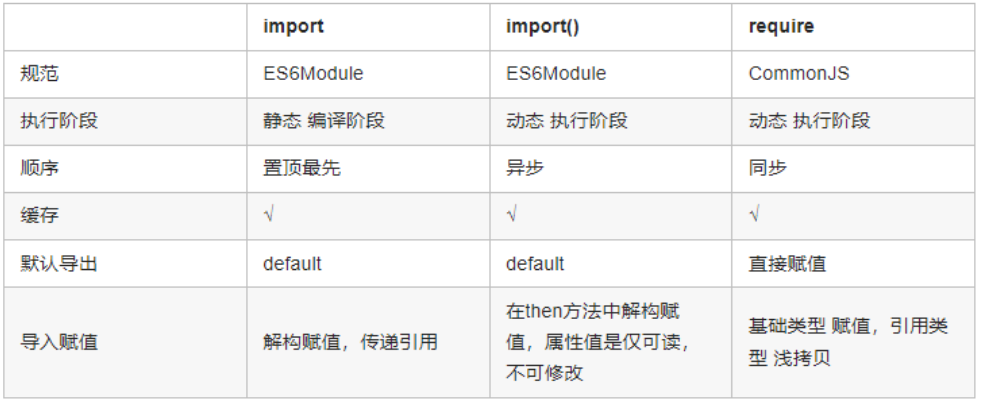

# 速记第七天
1. box-sizing的所有属性？
   - box-sizing 规定两个并排的带边框的框，语法为 box-sizing：content-box/border-box/inherit
   - content-box：宽度和高度分别应用到元素的内容框，在宽度和高度之外绘制元素的内边距和边框。【标准盒子模型】
   - border-box：为元素设定的宽度和高度决定了元素的边框盒。【IE 盒子模型】
   - inherit：继承父元素的 box-sizing 值。

2. async/await 的错误捕获方式?
   - try/catch, await 函数外，包裹 try {}，当 catch (error) 时，捕获错误
   - catch, async 函数返回的 Promise，调用 then 方法，然后 catch(error)
   - 使用返回错误优先原则, `const [err1, res1] = await stepOne(val => [null, val]).catch(e => [e, null])`

3. import、import() 和 require 的区别?
   


4. 如何自定义一个 webpack 插件 ？
   - 声明一个自定义命名的类或函数
   - 在自定义命名的类或函数在原型中新增 apply 方法
   - 声明由 Compiler 模块暴露的生命周期函数
   - 使用 webpack 提供的 API 或 自行处理内部实例的数据
   - 处理完成后，调用 webpack 提供的回调函数

5. 让一个元素水平垂直居中的方法？
   - 绝对定位 + 不确定当前 div 的宽度和高度：position + translate
   - 绝对定位 + 确定宽高： position + 负margin
   - 绝对定位 + 确定宽高： position + margin(auto)
   - 绝对定位 ： position + calc(), 动态计算实现水平垂直居中
   - flex: `display:flex;align-items: center; justify-content: center;`
   - table：`display: table-cell;vertical-align: middle; text-align:center;`

6. webpack 中 loader 与plugin的区别？

   **loader**
   在打包前或期间调用
   根据不同匹配条件处理资源
   调用顺序与书写顺序相反
   写在前面的接收写在后面的返回值作为输入值 

   **plugin**
   基于 `Tapable` 实现
   事件触发调用，监听 webpack 广播的事件
   不同生命周期改变输出结果

7. 什么是作用域 ? 什么是作用域链 ?
   创建函数的时候，已经声明了当前函数的作用域 ==> 当前创建函数所处的上下文。 

   **定义**
   作用域是变量与函数的可访问范围，由当前环境与上层环境的一系列变量对象组成

   **分类**
   全局作用域：代码在程序的任何地方都能被访问，window 对象的内置属性都拥有全局作用域。
   函数作用域：在函数内部的代码片段才能被访问
   块级作用域：是包含在{...}中的代码。let const 声明的是块级作用域变量

   **作用**
   作用域最大的用处就是隔离变量，不同作用域下同名变量不会有冲突。

   **作用域链**
   一般情况下，变量到 创建该变量 的作用域中取值。但是如果在当前作用域中没有查到，就会向上级作用域去查，直到查到全局作用域，这么一个查找过程形成的链条就叫做作用域链。


8. 什么是原型 ? 什么是原型链 ？
   JavaScript 一种基于原型的语言——每个函数对象都有一个 prototype 属性，这个属性指向函数的原型对象。
原型关系：
    - 每个 class都有显示原型 prototype
    - 每个实例都有隐式原型 __proto__ 
    - 实例的 __proto__ 指向对应 class 的 prototype  
  
   当试图访问一个对象的属性时，它不仅仅在该对象上搜寻，还会搜寻该对象的原型，以及该对象的原型的原型，依次层层向上搜索，直到找到一个名字匹配的属性或到达原型链的末尾。
   
   原型链：函数的原型链对象 constructor 默认指向函数本身，原型对象除了有原型属性外，为了实现继承，还有一个原型链指针 __proto__, 该指针是指向上一层的原型对象，而上一层的原型对象的结构依然类似。因此可以利用__proto__一直指向Object的原型对象上，而 Object 原型对象用 Object.prototype.__ proto__ = null 表示原型链顶端。如此形成了js的原型链继承。

   特点:  JavaScript 对象是通过引用来传递的，我们创建的每个新对象实体中并没有一份属于自己的原型副本。当我们修改原型时，与之相关的对象也会继承这一改变。

9. 谈一下JS中的类继承？
   
   **原型链继承**
   子类原型指向父类实例
   优点： 子类可以访问到父类新增原型方法和属性
   缺点： 无法实现多继承，创建实例不能传递参数
   ```js
    function Parent() {}
    function Child() {}
    Child.prototype = new Parent()
    const child = new Child()
   ```
  
   **构造函数继承**
   优点：可以实现多继承，创建实例可以传递参数
   缺点：实例并不是父类的实例，只是子类的实例，不能继承父类原型的方法
    ```js
        function Parent() {}
        function Child(...args) {
                Parent.call(this, ...args) // Parent.apply(this, args)
        }
        const child = new Child(1)
    ```

    **组合继承**
    优点：属性和原型链上的方法都可以继承，创建实例可以传递参数
    ```js
        function Parent() {}
        function Child(...args) {
                Parent.call(this, ...args)
        }
        Child.prototype = Object.create(Parent.prototype)
        Child.prototype.constructor = Child
        const child = new Child(1)
    ```

    **对象继承**
   优点：可以继承属性和方法
   缺点：创建实例无法传递参数，传入对象的属性有引用类型，所有类型都会共享相应的值
    ```js
    // Object.create
    const Parent = { property: 'value', method() {} }
    const Child = Object.create(Parent)

    // create
    const Parent = { property: 'value', method() {} }
    function create(obj) {
            function F() {}
            F.prototype = obj
            return new F()
    }
    const child  = create(Parent)
    ```

    **寄生组合继承(推荐)**
    ```js
    function Parent() {}
    function Child(...args) {
            Parent.call(this, args)
    }
    function create(obj) {
            function F() {}
            F.prototype =  obj
            return F
    }
    function extend(Child, Parent) {
            const clone = create(Parent.prototype)
            clone.constructor = Child
            Child.prototype = clone
    }
    extend(Child, Parent)
    const child = new Child(1)
    ```
    
    **ES6继承(最推荐)**
    ```js
    class Parent {
        constructor(property) {
                this.property = property
        }
            method() {}
    }
    class Child extends Parent {
            constructor(property) {
                    super(property)
            }
    }
    ```
